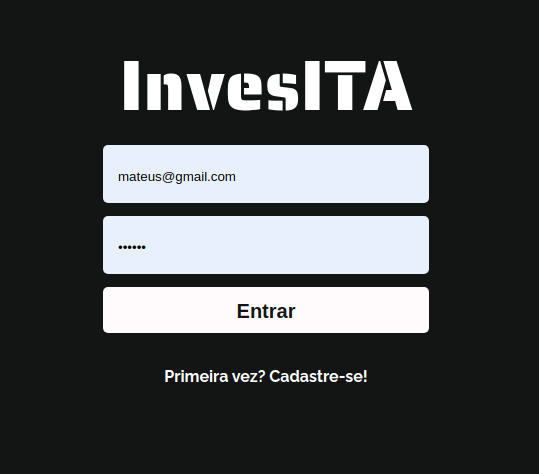
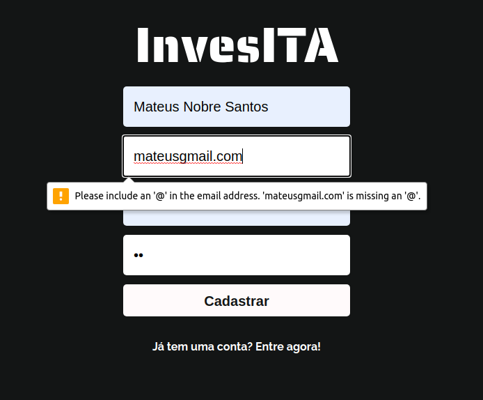
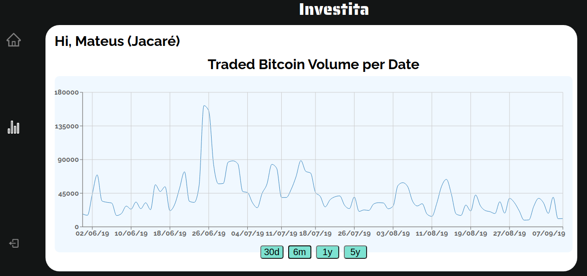
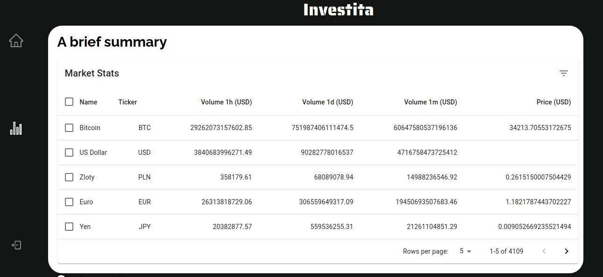

# Investita

A cryptocurrencies app to a user look for crypto data and beware  


## Developers
- Mateus Nobre
- Gabriel Tostes
- Jorge Márcio Lopes
- Lucas Inamine
- Otávio Henrique

## Preview Login


## Preview SignUp


## Preview Home


## Preview MarketStats



## React + Django + PostgreSQL + Docker Starter Kit

## Development Setup (Docker)

Requirements:

- Docker
- Docker Compose
- NodeJS and NPM

```bash
$ cp .env .env.dev # <- Update values as needed, but should be good as is
$ npm install --prefix ./web/frontend/
$ docker-compose up -d --build
$ docker-compose exec web npm start --prefix ./frontend/
Compiled successfully!

You can now view frontend in the browser.

  Local:            http://localhost:3000
  On Your Network:  http://172.19.0.3:3000

Note that the development build is not optimized.
To create a production build, use yarn build.
```

Hot reload should be working upon saving your JavaScript files.

To run migrations
```
docker-compose exec web python manage.py migrate 
```

Install npm packages
```
docker-compose exec web npm i package_name --prefix ./frontend/
```


To build the app production version
```
docker-compose exec web yarn run build --prefix ./frontend/
```